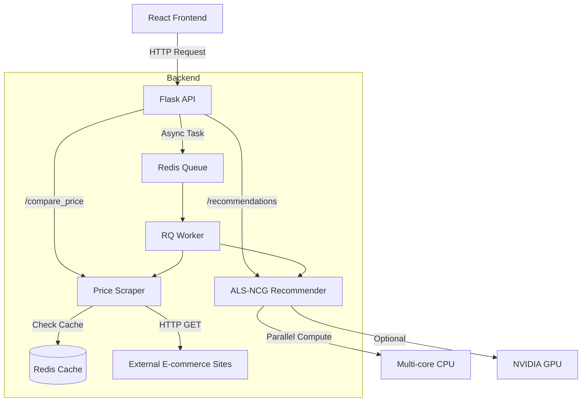

# System Architecture

## Overview
The **Parallel AI-based E-commerce Recommender & Multi-site Price Comparison Engine** is a monorepo project designed to demonstrate high-performance recommendation algorithms and real-time data aggregation. It consists of a Python Flask backend, a React frontend, a Redis caching layer, and background workers for asynchronous processing.

## Architecture Diagram

### High-Level Overview (ASCII)
```
+----------------+       +----------------+       +----------------+
|  React Client  | <---> |   Flask API    | <---> |  Redis Cache   |
+----------------+       +----------------+       +----------------+
        ^                        |                        ^
        |                        v                        |
        |                +----------------+       +----------------+
        |                |   RQ Worker    | <---> | External Sites |
        |                +----------------+       +----------------+
        |                        |
        |                        v
        |                +----------------+
        +----------------|   Recommender  |
                         |     Engine     |
                         +----------------+
```

### Detailed Component Flow (Mermaid)


## End-to-End Workflow

### 1. Recommendation Flow
1.  **User Request**: Client sends a GET request to `/recommendations?user_id=123`.
2.  **API Handling**: Flask receives the request.
    *   **Synchronous**: Calls `recommender.predict(user_id)`.
    *   **Asynchronous**: Enqueues a job to Redis via RQ and returns a `job_id`.
3.  **Recommender Engine**:
    *   Uses the pre-trained ALS (Alternating Least Squares) model.
    *   Computes dot product of User Factor Vector ($U_u$) and all Item Factor Vectors ($V$).
    *   Sorts items by predicted score.
4.  **Response**: Returns a list of recommended item IDs and scores.

### 2. Price Comparison Flow
1.  **User Request**: Client sends a GET request to `/compare_price?product=headphones`.
2.  **API Handling**: Flask initializes the `PriceScraper`.
3.  **Scraper Logic**:
    *   Checks Redis cache for `product=headphones`.
    *   If cached, returns data immediately.
    *   If miss, initiates parallel scraping threads for configured sites (Amazon, eBay, etc.).
4.  **External Request**: Sends HTTP requests to mock/real external sites.
5.  **Aggregation**: Parses HTML, extracts prices, and finds the best deal.
6.  **Caching**: Stores result in Redis with a TTL (e.g., 10 mins).
7.  **Response**: Returns a sorted list of prices and links.

## Technology Stack
-   **Backend**: Python, Flask, NumPy, SciPy, Numba (optional GPU).
-   **Frontend**: React, Material-UI, React Query.
-   **Data Store**: Redis (Cache & Queue).
-   **Containerization**: Docker, Docker Compose.
